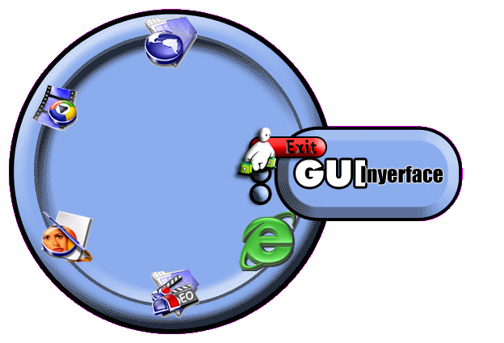



## GUI \- Graphical User INYERFACE\! \- Graphical Interface

### Description

Bit of fun programming a user interface. Can be applied to any application really. Shows use of shaped screens and custom graphic buttons, also the use of simple Shell commands to start applications.
 
### More Info
 

             |
---                |---
**Submitted On**   |2005-12-18 18:04:56
**By**             |[Ian Platt](https://github.com/Planet-Source-Code/PSCIndex/blob/master/ByAuthor/ian-platt.md)
**Level**          |Intermediate
**User Rating**    |5.0 (30 globes from 6 users)
**Compatibility**  |VB 6\.0
**Category**       |[Graphics](https://github.com/Planet-Source-Code/PSCIndex/blob/master/ByCategory/graphics__1-46.md)
**World**          |[Visual Basic](https://github.com/Planet-Source-Code/PSCIndex/blob/master/ByWorld/visual-basic.md)
**Archive File**   |[GUI\_\-\_Grap19575012182005\.zip](https://github.com/Planet-Source-Code/ian-platt-gui-graphical-user-inyerface-graphical-interface__1-63701/archive/master.zip)

